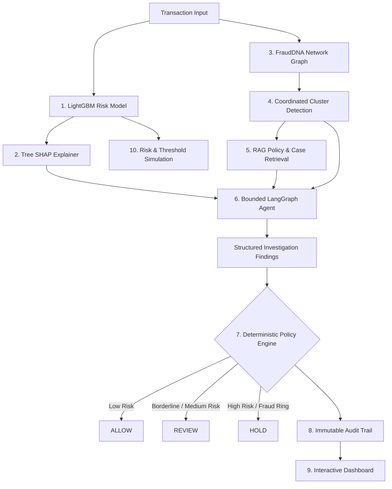

# FraudDNA

> **Defense-Only AI Fraud Intelligence & Relationship Graph Platform**
> Built for the **Razorpay AI Buildathon 2026** — Track 02: **AI Risk Manager**
> Core Thesis: *Individually normal transactions become suspicious when their relationships reveal coordinated behavior.*

---

## 📌 Core Architecture Principle

```text
ML predicts.
Graph discovers.
XAI explains.
RAG grounds.
The AI agent investigates.
Deterministic policies control financial actions.
```

Financial actions (`ALLOW`, `REVIEW`, `HOLD`) are strictly controlled by a **deterministic policy engine**. The AI agent is strictly **read-only, bounded, and explainable**—it can never move money, block cards, or alter payments directly.

---

## 🚀 The End-to-End Pipeline



---

## 🔍 Why FraudDNA?

### The Problem
Traditional fraud detection analyzes transactions in isolation. Sophisticated fraudsters exploit this blind spot using **coordinated syndicates**:
- Rotating device fingerprints across synthetic accounts.
- Rapid card cycling through distributed proxy IP pools.
- Structuring small-value transactions that fly beneath individual volume velocity rules.

When analyzed individually, each transaction appears legitimate.

### The Innovation
**FraudDNA** uncovers cross-entity relationships by building a dynamic bipartite entity-transaction graph:
1. **Relationship-Aware Intelligence**: Connects IP addresses, device IDs, cards, and accounts into clusters.
2. **Coordinated Syndicate Detection**: Identifies shared infrastructure (e.g. 51 transactions sharing device `dev_syndicate_alpha_01`).
3. **Multi-Layered Grounded Reasoning**: Combines tabular ML (LightGBM), local explainability (SHAP), semantic retrieval (RAG over merchant policies), and multi-step agentic investigation (LangGraph) under strict deterministic safety boundaries.

---

## 🛠️ Tech Stack

| Domain | Technologies |
|---|---|
| **Backend** | Python 3.12, FastAPI, Pydantic v2, SQLAlchemy, Uvicorn |
| **ML & XAI** | LightGBM, scikit-learn, Tree SHAP |
| **Graph Intelligence** | NetworkX (Bipartite entity-transaction projection, connected components) |
| **Agentic AI** | LangGraph (StateGraph, bounded execution, 7 read-only investigation tools) |
| **RAG & Search** | pgvector / PostgreSQL 16 (with deterministic in-memory vector fallback) |
| **Frontend** | Next.js 16 (App Router), React 19, TypeScript (strict), Tailwind CSS |
| **Testing & Quality** | pytest (117 tests), Ruff, Mypy, ESLint, GitHub Actions CI |

---

## 📊 Held-Out Model Evaluation

> [!IMPORTANT]
> **Transparent Disclosure: Synthetic Dataset & Held-Out Evaluation**
> All metrics are calculated on a strictly separated held-out test split of 3,750 synthetic transactions generated with deterministic seeds. No live merchant or customer data is used.

| Metric | Held-Out Test Set Score |
|---|---|
| **Test Set Size** | 3,750 transactions (176 fraud, 3,574 legitimate) |
| **Precision** | **99.44%** |
| **Recall** | **100.00%** |
| **F1 Score** | **0.9972** |
| **PR-AUC (Average Precision)** | **1.0000** |
| **ROC-AUC** | **1.0000** |
| **False Positive Rate** | **0.03%** (1 false positive in 3,574 clean transactions) |
| **Monetary Cost of False Positives** | ₹350.00 (model assumed cost ₹350/FP) |
| **Total Fraud Exposure Prevented** | ₹24,32,457.54 |
| **Net Business Benefit** | **₹24,32,107.54** |

### Scenario Catch Rates
- **Coordinated Device Ring**: 51 / 51 caught (**100%**)
- **Coordinated IP Farm**: 45 / 45 caught (**100%**)
- **Coordinated Card Cycle**: 21 / 21 caught (**100%**)
- **Individual High-Value Anomaly**: 59 / 59 caught (**100%**)

---

## 🛡️ Safety & Architectural Boundaries

FraudDNA is engineered strictly as a **defense-only** system:
- **Zero Financial Side Effects**: The LLM agent has **zero write permissions**. It cannot approve, decline, block, or trigger payouts.
- **Deterministic Financial Decisions**: Every financial action (`ALLOW`, `REVIEW`, `HOLD`) is executed strictly by the Python `PolicyEngine` based on risk score thresholds and cluster flags.
- **Bounded Agent Execution**: The LangGraph agent runs with an enforced step ceiling (default: 6 steps, max: 10). It accesses only 7 allowlisted read-only tools.
- **Deterministic Offline Fallback**: If an external LLM API key is not configured or an AI provider times out, the system automatically falls back to an offline deterministic reasoning engine without breaking the pipeline.
- **RAG Degradation Safety**: If pgvector/PostgreSQL is unreachable, the system falls back to in-memory cosine similarity and documents the degraded state in the audit trail without fabricating citations.

---

## ⚡ Quick Start & Running Locally

### Prerequisites
- Python >= 3.12
- Node.js >= 20.x, npm >= 10.x
- Docker & Docker Compose (optional, for containerized run)

### 1. Clone & Configure Environment
```bash
git clone https://github.com/cometVS7/FraudDNA.git
cd FraudDNA
cp .env.example .env
```

### 2. Backend Setup
```bash
# Set up Python virtual environment
python -m venv .venv

# On Windows:
.\.venv\Scripts\activate
# On Linux/macOS:
source .venv/bin/activate

# Install backend package and dependencies
pip install -e "backend[dev]"

# Start FastAPI server
uvicorn app.main:app --reload --host 0.0.0.0 --port 8000
```
- API Base: `http://localhost:8000/api/v1`
- Swagger Docs: `http://localhost:8000/docs`
- Health Check: `http://localhost:8000/api/v1/health`

### 3. Frontend Setup
```bash
cd frontend
npm install
npm run dev
```
- Web Application: `http://localhost:3000`

---

## 🐳 Docker Deployment

### Run Complete Multi-Container Stack
```bash
docker compose up --build
```
This orchestrates:
1. `postgres`: PostgreSQL 16 with `pgvector` extension enabled on port `5432`
2. `backend`: FastAPI application on port `8000`
3. `frontend`: Next.js 16 production server on port `3000`

---

## 🧪 Verification & Quality Suite

Run all verification gates locally before deployment:

### Backend Quality Suite (117 Tests)
```bash
# Run complete test suite (E2E + unit + integration)
pytest backend/tests -v

# Run Ruff linter and formatting checks
ruff check backend
ruff format --check backend

# Run Mypy static type analysis
mypy backend/app
```

### Frontend Quality Suite
```bash
cd frontend
npm run lint          # ESLint
npm run type-check    # TypeScript strict check
npm run build         # Next.js production build (all 9 routes)
```

---

## 🎬 Buildathon 3–5 Minute Demo Walkthrough

Judges can follow this exact sequence to experience the full FraudDNA intelligence loop:

1. **Overview Dashboard (`/`)**:
   - Observe the executive risk overview: transaction counts, risk distribution (ALLOW / REVIEW / HOLD), and recent alerts.
2. **Transaction Ledger (`/transactions`)**:
   - Filter by `High Risk` or search for coordinated syndicate transaction `tx_0001991`.
3. **Investigation Center (`/investigate?tx_id=tx_0001991`)**:
   - **Step 1 - ML Score**: View the LightGBM probability score (`1.000` risk).
   - **Step 2 - SHAP Factors**: Inspect the waterfall plot revealing top risk drivers (e.g. device transaction velocity, unusual hour, high amount).
   - **Step 3 - Relationship Graph**: Observe the shared infrastructure badge linking this transaction to a 51-node device ring (`cluster_ded73b2ac8d1`).
   - **Step 4 - RAG Evidence**: Inspect grounded policy citations from `GDL-001` (Coordinated Syndicate Playbook) and `POL-002` (Escalation Protocol).
   - **Step 5 - AI Agent Trace**: Expand the LangGraph investigation trace showing bounded read-only tool calls and structured hypothesis generation.
   - **Step 6 - Policy Decision**: Verify the final deterministic **`HOLD`** decision with immutable reason codes.
4. **FraudDNA Graph Explorer (`/frauddna`)**:
   - Explore the interactive visual graph showing multi-entity hops between cards, shared devices, and IP subnets.
5. **Risk & Policy Simulation (`/simulation`)**:
   - Adjust the decision threshold slider from `0.37` to `0.60`.
   - Watch live recalculation of false positive costs, prevented fraud loss, and precision/recall trade-offs.
6. **Audit Trail (`/audit`)**:
   - Review the cryptographically hashed, timestamped log of the investigation and policy decision.

---

## 📄 License & Intellectual Property

Developed for the **Razorpay AI Buildathon 2026**. Designed strictly for fraud defense and security intelligence. All synthetic datasets and code artifacts are provided for evaluation and demonstration purposes.
