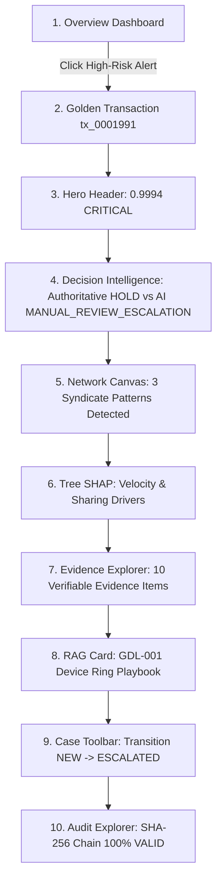

# FraudDNA — UI-01: UX Architecture & Analyst Experience Specification

**Document Status**: APPROVED DESIGN SPECIFICATION  
**Target Platform**: FraudDNA Financial Crime Intelligence & Investigation Workbench  
**Repository**: `cometVS7/FraudDNA`  
**Active Branch**: `v2/production-platform`  
**Track**: 02 — AI Risk Manager (Razorpay AI Buildathon 2026)  
**Product Identity**: *FraudDNA — Detect the fraud hiding between the transactions.*  
**Core Invariant**: *ML predicts. Graph discovers. XAI explains. RAG grounds. The AI agent investigates. Deterministic policies control financial actions.*

---

## 1. Product UX Principles

1. **Information Density without Clutter**: Provide immediate forensic clarity for high-stress triage without unnecessary decorative elements or marketing fluff.
2. **Deterministic-First Authority**: Always make authoritative financial decisions (`ALLOW`, `REVIEW`, `HOLD`) unmistakable and visually decoupled from advisory AI recommendations (`MANUAL_REVIEW_ESCALATION`, `CLOSE_BENIGN`).
3. **Graph-Driven Connected Intelligence**: Surface hidden syndicate relationships (shared devices, IPs, cards) directly alongside individual transaction facts.
4. **Grounded Provenance**: Every AI finding and risk claim must link to verifiable empirical evidence or cited regulatory playbooks.
5. **Zero-Friction Golden Flow**: Enable analysts to move seamlessly from Overview -> Transaction -> Network -> XAI -> Evidence -> AI Investigation -> Case Creation -> Audit Verification in under 3 clicks.

---

## 2. Analyst Personas & Primary Workflows

### Persona A: Senior Fraud Risk Analyst (Triage & Case Adjudication)
- **Primary Need**: Rapidly inspect high-risk transactions (`risk_score >= 0.85`), understand why the PolicyEngine placed a `HOLD`, inspect syndicate rings, review AI advisory recommendations, and escalate to a formal operational case.
- **Key Interface**: `/investigate` (Workbench) and `/cases` (Case Queue).

### Persona B: FinCrime & Compliance Auditor
- **Primary Need**: Verify that every policy decision, risk assessment, and AI investigation was recorded in the tamper-evident SHA-256 audit ledger with unbroken cryptographic linkage.
- **Key Interface**: `/audit` (Cryptographic Verifier).

### Persona C: Risk Policy & ML Operations Engineer
- **Primary Need**: Simulate threshold changes, analyze false positive monetary tradeoffs, and inspect held-out model metrics.
- **Key Interface**: `/simulation` and `/evaluation`.

---

## 3. Information Architecture & Navigation Model

The application is structured into three clear operational domains:

```
┌─────────────────────────────────────────────────────────────────────────────────┐
│                                FRAUDDNA CONSOLE                                 │
├──────────────────────┬─────────────────────────────┬────────────────────────────┤
│ 1. OPERATIONS        │ 2. INTELLIGENCE             │ 3. GOVERNANCE              │
│  - Overview (/)      │  - Transactions (/transactions)│ - Audit Explorer (/audit) │
│  - Case Queue (/cases)│ - Risk Networks (/frauddna) │ - Simulation (/simulation) │
│  - Workbench (/investigate)                        │ - Evaluation (/evaluation) │
└──────────────────────┴─────────────────────────────┴────────────────────────────┘
```

---

## 4. Hero Experience: Investigation Workbench Architecture (`/investigate`)

The Investigation Workbench is the flagship workspace for fraud analysts:

```
┌─────────────────────────────────────────────────────────────────────────────────┐
│ HERO HEADER: Transaction Facts, Score (0.9994 CRITICAL), Policy: HOLD, Bind Case│
├─────────────────────────────────────────────────────────────────────────────────┤
│ DECISION INTELLIGENCE: Authoritative Policy Gate vs AI Advisory Recommendation  │
├────────────────────────┬─────────────────────────────┬──────────────────────────┤
│ COLUMN 1: FACTS & XAI  │ COLUMN 2: NETWORK & GRAPH   │ COLUMN 3: AI & EVIDENCE  │
│ (3 Cols)               │ (6 Cols)                    │ (3 Cols)                 │
│                        │                             │                          │
│ • Transaction Ledger   │ • @xyflow/react Canvas      │ • Case Action Toolbar    │
│ • Attribute Metadata   │ • Radial Ego-Subgraph       │ • AI Dossier Findings    │
│ • Clickable Entities   │ • Syndicate Pattern Badges  │ • Evidence Explorer      │
│ • Tree SHAP Waterfall  │ • Regulatory RAG Citations  │ • Tool Trace Records     │
│   (Positive/Negative)  │ • Multi-Hop Path Finder     │ • Limitations & Provenance│
└────────────────────────┴─────────────────────────────┴──────────────────────────┘
```

---

## 5. Golden Demo User Journey (`tx_0001991`)



---

## 6. Decision Intelligence & Policy Separation UX

To ensure absolute visual and architectural clarity:
1. **Authoritative Policy Gate** (Left Panel):
   - Solid Crimson border (`#D05B5B`), Shield icon, explicit badge: `HOLD (Settlement Blocked)`.
   - Displays deterministic reason codes: `CRITICAL_RISK_SCORE`, `DEVICE_REUSE_BURST`.
   - Subtext: *"Pure Deterministic Logic — No Non-Deterministic LLM Dependency"*.
2. **AI Investigation Advisory** (Right Panel):
   - Warm Copper border (`#CC9166`), Bot icon, explicit badge: `ADVISORY ONLY`.
   - Action: `MANUAL_REVIEW_ESCALATION`.
   - Displays confidence score (`92%`), verified evidence count (`10 items`), and reasoning summary.

---

## 7. Network Intelligence & Graph UX

- **Engine**: `@xyflow/react` interactive canvas.
- **Node Semantics**:
  - `TX` (Transaction): Blue accent (`#3B82F6`)
  - `CU` (Customer): Purple accent (`#8B5CF6`)
  - `DV` (Device): Orange accent (`#F97316`)
  - `IP` (IP Address): Cyan accent (`#06B6D4`)
  - `CD` (Payment Card): Emerald accent (`#10B981`)
- **Interactive Controls**:
  - Concentric layout centered on investigated transaction.
  - Depth Selector ($d \in \{1, 2, 3\}$).
  - Selected node highlighting with warm copper glow (`#CC9166`).
  - Clicking any node opens the slide-over **Entity Profile Drawer**.
  - **Find Paths Dialog**: Executes bounded BFS between two entities with ranked narrative explanations.

---

## 8. Syndicate Patterns UX

Patterns detected by the backend `SyndicateDetector` are rendered as rich analytical badges:
- `DEVICE_REUSE_RING` -> **Device Reuse Ring** (*"Multiple distinct customers routing through identical hardware fingerprints"*)
- `CARD_SHARING_RING` -> **Card Sharing Ring** (*"Single payment card linked across divergent accounts and IPs"*)
- `MULTI_INFRASTRUCTURE_COLLUSION` -> **Multi-Infrastructure Collusion** (*"Shared device, card, and proxy networks operating simultaneously"*)

---

## 9. XAI (Explainable AI) Waterfall UX

- **Component**: `ShapWaterfall`
- Visualizes the Top Tree SHAP feature attributions.
- **Red Bars (`#D05B5B`)**: Risk-elevating forces (e.g., `device_reuse_count = 14`, `velocity_1h = 9`).
- **Green Bars (`#10B981`)**: Risk-mitigating forces (e.g., `customer_account_age = 623 days`).
- Displays exact numerical contribution magnitude ($\pm \text{SHAP Value}$).

---

## 10. Evidence & RAG Provenance UX

- **Evidence Explorer**:
  - Displays evidence items grouped by category (`TRANSACTION_EVIDENCE`, `ENTITY_EVIDENCE`, `NETWORK_EVIDENCE`, `XAI_EVIDENCE`, `TYPOLOGY_EVIDENCE`).
  - Every item displays deterministic evidence ID (`evi_...`), confidence tag, snippet, and traceable source.
- **RAG Typology Card**:
  - Displays retrieved regulatory guidelines (`GDL-001`, `GDL-002`) and historical case precedents (`CASE-2025-089`).
  - Highlights similarity score and direct quoted rule text.

---

## 11. Case Management Workflow UX

- **State Transitions**:
  $$\text{NEW} \longrightarrow \text{IN\_REVIEW} \longrightarrow \text{ESCALATED} \longrightarrow \text{RESOLVED} \longrightarrow \text{CLOSED}$$
- Case Actions toolbar provides one-click lifecycle transitions with optional analyst notes.
- Linked investigations on `/cases/[case_id]` provide direct deep-links back into the Workbench with context preserved.

---

## 12. Audit Trail & Cryptographic Verification UX

- `/audit` displays the immutable governance ledger.
- **Cryptographic Proof Banner**:
  - Live button triggers `verifyAuditChain()`.
  - Computes recursive SHA-256 hashes ($H_i = \text{SHA256}(H_{i-1} \parallel \text{Payload})$).
  - Displays `100% VALID` confirmation badge and total verified blocks count.

---

## 13. Progressive Loading & Error Boundaries

1. **Fast Path (< 10ms)**: Transaction Facts, PolicyEngine Decision, Risk Distribution render immediately.
2. **Medium Path (< 30ms)**: Ego-Subgraph, Syndicate Patterns, Tree SHAP attributions populate.
3. **Async Analytical Path (20ms - 1500ms)**: AI Dossier and RAG citations stream in with dedicated skeleton loaders, never blocking the primary interface.
4. **Graceful Fallbacks**:
   - If AI provider times out, AI Dossier automatically displays the deterministic grounded fallback synthesis with an informational indicator.
   - If PostgreSQL is offline, system functions smoothly in offline mode and displays a discrete status pill.

---

## 14. Visual Design System

```
========================================================================================
                               COLOR PALETTE SPECIFICATION
========================================================================================
  Role                Hex Code    Usage
----------------------------------------------------------------------------------------
  Background Canvas   #040406     Primary app background
  Card Surface        #121317     Elevated panels, cards, tables
  Surface Accent      #08080A     Card headers, tab bars
  Subtle Border       #1C1D22     Dividers, table grid lines
  Active Border       #2E3038     Interactive borders, hover outlines
  Brand Accent        #CC9166     Warm copper (Highlights, active tabs, buttons)
  Critical / Hold     #D05B5B     Critical risk, HOLD decision, positive SHAP forces
  Warning / Review    #C47A63     High risk, REVIEW decision
  Normal / Allow      #10B981     Low risk, ALLOW decision, negative SHAP forces
  Primary Text        #E2E3E9     Primary headings, data values
  Muted Text          #777A88     Labels, metadata, timestamps
========================================================================================
```

---

## 15. Final Acceptance Matrix

| Area | Designed | Backend Contract Verified | Ready for Implementation |
|:---|:---:|:---:|:---:|
| **Navigation** | YES | YES | YES |
| **Overview** | YES | YES | YES |
| **Case Queue** | YES | YES | YES |
| **Case Detail** | YES | YES | YES |
| **Investigation Workbench** | YES | YES | YES |
| **Transaction Intelligence** | YES | YES | YES |
| **Entity Intelligence** | YES | YES | YES |
| **Network Graph** | YES | YES | YES |
| **Syndicate Patterns** | YES | YES | YES |
| **SHAP / XAI** | YES | YES | YES |
| **Evidence Explorer** | YES | YES | YES |
| **RAG Citations** | YES | YES | YES |
| **AI Investigation Dossier** | YES | YES | YES |
| **Decision Intelligence** | YES | YES | YES |
| **Case Workflow** | YES | YES | YES |
| **Audit Verifier** | YES | YES | YES |
| **Simulation** | YES | YES | YES |
| **Evaluation** | YES | YES | YES |
| **Deep Links** | YES | YES | YES |
| **Loading & Skeletons** | YES | YES | YES |
| **Security & XSS Defense** | YES | YES | YES |
| **Accessibility (a11y)** | YES | YES | YES |
| **Responsive UX** | YES | YES | YES |
| **Performance Strategy** | YES | YES | YES |

---

## 16. Final Design Gate Verdict

```
========================================================================================
                               FINAL DESIGN GATE VERDICT:
                          PASS — READY FOR UI IMPLEMENTATION
========================================================================================
```
