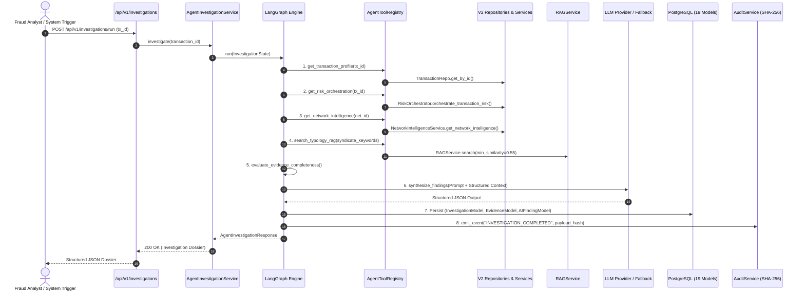

# FraudDNA V2-08 — Architecture & Technical Specification
## Autonomous AI Investigation Agent, Bounded LangGraph State Machine & Grounded Evidence Engine

---

## 1. Executive Architectural Overview

**FraudDNA V2-08** establishes the AI Investigation Agent layer sitting on top of the V2 database persistence, multi-layer risk orchestrator (V2-06), risk network intelligence engine (V2-07), and RAG vector retrieval subsystems.

```
┌────────────────────────────────────────────────────────────────────────────────────────────────────────┐
│                                       V2-08 ARCHITECTURE OVERVIEW                                      │
│                                                                                                        │
│   [ REST API LAYER ]                                                                                   │
│   POST /api/v1/investigations/run  ──►  [ AgentInvestigationService ]                                  │
│                                                   │                                                    │
│                                                   ▼                                                    │
│   [ LANGGRAPH WORKFLOW ENGINE ]                                                                        │
│   ┌────────────────────────────────────────────────────────────────────────────────────────────────┐   │
│   │ 1. InitializeState ──► 2. ExtractPrimaryContext ──► 3. OrchestrateRiskContext                  │   │
│   │                                                               │                                │   │
│   │ 6. EvaluateEvidence ◄── 5. RetrieveTypologyRAG ◄── 4. InvestigateNetworkSyndicate              │   │
│   │          │                                                                                     │   │
│   │          ├── (Iterative Tool Follow-up, max 10 calls)                                          │   │
│   │          ▼                                                                                     │   │
│   │ 7. SynthesizeFindings (LLM Provider / Deterministic Fallback Engine)                           │   │
│   │          │                                                                                     │   │
│   │          ▼                                                                                     │   │
│   │ 8. ValidateAndPersist (Pydantic Validation, PostgreSQL Models, SHA-256 Audit Trail)           │   │
│   └────────────────────────────────────────────────────────────────────────────────────────────────┘   │
│                                                   │                                                    │
│                                                   ▼                                                    │
│   [ READ-ONLY INVESTIGATION TOOL REGISTRY ]                                                            │
│   ├── TransactionRepo   ──► Transaction Profile & Metadata                                             │
│   ├── RiskOrchestrator  ──► 4-Layer Risk (R_tx, R_ent, R_net, R_beh), Confidence, Signals             │
│   ├── EntityRepo        ──► Entity Profile, Velocity, Bounded Ego-Graph (d <= 3)                       │
│   ├── NetworkIntel      ──► 7 Syndicate Patterns, Topology, Exposure, Multi-Hop Paths S(P)             │
│   ├── RAGService        ──► Typology Playbooks (GDL, CASE, POL) with Citation Tracking                 │
│   └── AuditRepo         ──► Cryptographic Decision & Event History                                     │
│                                                   │                                                    │
│                                                   ▼                                                    │
│   [ IMMUTABLE PERSISTENCE & AUDIT ]                                                                    │
│   PostgreSQL 16: [investigations] + [evidence] + [ai_findings] + [audit_events]                        │
└────────────────────────────────────────────────────────────────────────────────────────────────────────┘
```

---

## 2. The Core Architectural Invariant & Zero Financial Authority

```
┌────────────────────────────────────────────────────────────────────────────────────────┐
│                              NON-NEGOTIABLE INVARIANT                                  │
│                                                                                        │
│   ML predicts.                                                                         │
│   Graph discovers.                                                                     │
│   XAI explains.                                                                        │
│   RAG grounds.                                                                         │
│   The AI agent investigates.                                                           │
│   Deterministic policies control financial actions.                                    │
└────────────────────────────────────────────────────────────────────────────────────────┘
```

### Invariant Enforcement Mechanisms:
1. **No Mutation Capabilities in Toolset**: All 9 agent tools are purely `SELECT`-driven read-only query interfaces. Tools do not import `commit()`, `add()`, or mutating service methods.
2. **Advisory Case Recommendations**: The output field `recommended_next_action` (e.g. `MANUAL_REVIEW_ESCALATION`, `MERCHANT_INQUIRY`, `CLOSE_BENIGN`) is purely informational for human fraud analysts; it has zero coupling to the `DecisionModel.action` (`ALLOW`, `REVIEW`, `HOLD`).
3. **Immutable Policy Gate**: The pure-rule deterministic Policy Engine (`app.policy.rules`) evaluates transactions independently of the AI Agent.

---

## 3. Investigation Lifecycle

The complete investigation lifecycle proceeds across 12 distinct steps:



---

## 4. LangGraph Bounded State Machine

### 4.1 Typed State Schema (`InvestigationState`)

```python
class InvestigationState(TypedDict, total=False):
    """Authoritative TypedDict state passed across LangGraph nodes."""

    # Context & Identifiers
    correlation_id: str
    investigation_id: str
    transaction_id: str
    customer_id: str | None
    network_id: str | None

    # Step & Budget Tracking
    current_step: int
    max_steps: int
    tool_budget: int
    tools_called_count: int

    # Observable Tool Execution Traces
    tools_called: list[str]
    tool_trace: list[dict[str, Any]]
    errors: list[str]
    limitations: list[str]

    # Grounded Evidence & Context Caches
    transaction_context: dict[str, Any]
    risk_orchestration_context: dict[str, Any]
    shap_signals_context: list[dict[str, Any]]
    entity_profile_context: dict[str, Any]
    ego_graph_context: dict[str, Any]
    network_intelligence_context: dict[str, Any]
    multi_hop_paths_context: list[dict[str, Any]]
    typology_rag_context: list[dict[str, Any]]
    audit_history_context: list[dict[str, Any]]

    # Verified Evidence Items (Accumulator)
    accumulated_evidence: list[dict[str, Any]]

    # Synthesis & Output
    structured_findings: dict[str, Any] | None
    confidence_score: float
    status: str  # "completed", "degraded", "failed"
    is_complete: bool
```

### 4.2 State Machine Nodes & Transitions

```
                    ┌─────────────────────────┐
                    │    1. initialize        │
                    └────────────┬────────────┘
                                 │
                                 ▼
                    ┌─────────────────────────┐
                    │ 2. extract_primary_ctx  │
                    └────────────┬────────────┘
                                 │
                                 ▼
                    ┌─────────────────────────┐
                    │ 3. orchestrate_risk_ctx │
                    └────────────┬────────────┘
                                 │
                                 ▼
                    ┌─────────────────────────┐
                    │ 4. investigate_network  │
                    └────────────┬────────────┘
                                 │
                                 ▼
                    ┌─────────────────────────┐
                    │  5. retrieve_typology   │
                    └────────────┬────────────┘
                                 │
                                 ▼
                    ┌─────────────────────────┐
                    │  6. evaluate_evidence   │◄────────────────┐
                    └────────────┬────────────┘                 │
                                 │                              │
                    [Evidence Gap & Budget Left?]               │ (Iterative Follow-up)
                    ├── Yes ──► [execute_targeted_tool] ────────┘
                    └── No / Budget Reached
                                 │
                                 ▼
                    ┌─────────────────────────┐
                    │  7. synthesize_findings │
                    │   (LLM / Fallback Eng)  │
                    └────────────┬────────────┘
                                 │
                                 ▼
                    ┌─────────────────────────┐
                    │ 8. validate_and_persist │
                    └────────────┬────────────┘
                                 │
                                 ▼
                              [ END ]
```

### 4.3 Node Execution Details

1. `initialize_node`: Generates deterministic investigation ID `inv_<sha256(tx_id:timestamp)>`, initializes empty accumulator arrays, binds correlation ID.
2. `extract_primary_context_node`: Calls `get_transaction_profile` and `get_entity_profile`. Sets `customer_id` and `network_id`.
3. `orchestrate_risk_context_node`: Calls `get_risk_orchestration` and `get_shap_signals`. Populates 4-layer risk vectors ($R_{tx}, R_{ent}, R_{net}, R_{beh}$) and Top-5 Tree SHAP feature contributions.
4. `investigate_network_node`: If `network_id` is present, calls `get_network_intelligence` and `search_network_paths`. Extracts active syndicate patterns (`SyndicatePatternType`) and multi-hop paths $S(P)$.
5. `retrieve_typology_rag_node`: Forms targeted semantic queries from detected syndicate patterns and SHAP anomalies; queries RAG vector store for playbooks and guidelines.
6. `evaluate_evidence_node`: Evaluates evidence completeness score $C_e$. If $C_e < 0.70$ and remaining tool budget $> 0$, schedules specific follow-up tool queries (e.g. ego-graph depth expansion or audit trail lookup).
7. `synthesize_findings_node`: Formats structured context into isolated XML/delimiter prompts and invokes `BaseLLMProvider`. In case of provider timeout or error, executes `DeterministicFallbackEngine`.
8. `validate_and_persist_node`: Validates output against `AgentInvestigationOutput` Pydantic schema, creates `InvestigationModel`, `EvidenceModel`, `AIFindingModel`, flushes to PostgreSQL, and calls `AuditService.record_event()` with SHA-256 hash.

---

## 5. Read-Only Tool Architecture & Contracts

All 9 tools reside in `app.agent.tools.AgentTools` and follow strict Pydantic parameter schemas:

```
+----+----------------------------+------------------------------------+--------------------------+
| #  | Tool Name                  | Primary Parameters                 | Bound / Limit Constraint |
+----+----------------------------+------------------------------------+--------------------------+
| 1  | get_transaction_profile    | transaction_id: str                | Exact single ID lookup   |
| 2  | get_risk_orchestration     | transaction_id: str                | 4-layer composite risk   |
| 3  | get_shap_signals           | transaction_id: str                | Top 5 signals (rank 1-5) |
| 4  | get_entity_profile         | entity_type: str, entity_id: str   | Single entity record     |
| 5  | get_entity_ego_graph       | entity_type, entity_id, depth, max | 1 <= d <= 3, max <= 100  |
| 6  | get_network_intelligence   | network_id: str, max_tx: int       | max_tx <= 100            |
| 7  | search_network_paths       | source_id: str, target_id: str     | max_depth <= 3, max <= 10|
| 8  | search_typology_rag        | query: str, top_k: int, category   | 1 <= top_k <= 5          |
| 9  | get_audit_history          | entity_id: str, limit: int         | 1 <= limit <= 20         |
+----+----------------------------+------------------------------------+--------------------------+
```

### Concrete Tool Parameter & Return Schemas:
```python
class EgoGraphToolInput(BaseModel):
    model_config = ConfigDict(extra="forbid")
    entity_type: str = Field(..., pattern="^(customer|device|card|ip|merchant)$")
    entity_id: str = Field(..., min_length=1, max_length=64)
    depth: int = Field(default=2, ge=1, le=3)
    max_nodes: int = Field(default=50, ge=5, le=100)

class TypologySearchToolInput(BaseModel):
    model_config = ConfigDict(extra="forbid")
    query: str = Field(..., min_length=3, max_length=256)
    top_k: int = Field(default=3, ge=1, le=5)
    category: str | None = Field(default=None, pattern="^(guidelines|cases|policies)$")
```

---

## 6. RAG / Typology Knowledge Grounding

### 6.1 Indexing & Embeddings
- Knowledge base markdown documents located in `knowledge/guidelines/`, `knowledge/historical_cases/`, and `knowledge/policies/`.
- Embedded via `DeterministicLocalEmbeddingProvider` (or production OpenAI/Gemini embeddings) and stored in `PgVectorVectorStore` / `InMemoryVectorStore`.

### 6.2 Grounding Prompt Architecture & Context Separation
To prevent LLM hallucination, synthesis prompts strictly separate data categories:

```
============================== FRAUDDNA INVESTIGATION CONTEXT ==============================
<<<SECTION: OBSERVED_TRANSACTION_EVIDENCE>>>
{transaction_profile_json}

<<<SECTION: MULTI_LAYER_RISK_AND_XAI>>>
Composite Risk: {composite_risk} | Tier: {risk_tier} | Confidence: {confidence}
Layer Contributions: {layer_breakdown_json}
Top SHAP Signals: {shap_signals_json}

<<<SECTION: NETWORK_SYNDICATE_INTELLIGENCE>>>
Network ID: {network_id} | Name: {network_name} | Suspicious: {is_suspicious}
Active Syndicate Patterns: {syndicate_patterns_json}
Key Ranked Paths: {network_paths_json}

<<<SECTION: RETRIEVED_REGULATORY_TYPOLOGIES>>>
{typology_rag_chunks_with_doc_ids}

<<<SECTION: AUDIT_HISTORY>>>
{audit_history_json}
============================================================================================
```

---

## 7. Structured Output Pydantic Schemas

```python
class EvidenceCategory(StrEnum):
    TRANSACTION = "TRANSACTION_EVIDENCE"
    XAI = "XAI_EVIDENCE"
    ENTITY = "ENTITY_EVIDENCE"
    NETWORK = "NETWORK_EVIDENCE"
    TYPOLOGY = "TYPOLOGY_EVIDENCE"
    AUDIT = "AUDIT_EVIDENCE"

class EvidenceItem(BaseModel):
    model_config = ConfigDict(extra="forbid")
    id: str = Field(..., description="Unique deterministic evidence ID (evi_...)")
    category: EvidenceCategory
    source: str = Field(..., description="Subsystem providing evidence")
    source_id: str = Field(..., description="Referenced entity ID, tx ID, or doc ID")
    snippet: str = Field(..., description="Verifiable factual finding")
    severity: str = Field(..., description="LOW, MEDIUM, HIGH, CRITICAL")
    confidence: float = Field(..., ge=0.0, le=1.0)

class AgentFindingOutput(BaseModel):
    model_config = ConfigDict(extra="forbid")
    finding_id: str
    finding_type: str
    statement: str
    supporting_evidence_ids: list[str]
    confidence: float = Field(..., ge=0.0, le=1.0)

class AgentInvestigationOutput(BaseModel):
    model_config = ConfigDict(extra="forbid")
    investigation_id: str
    transaction_id: str
    risk_level: str
    risk_score: float = Field(..., ge=0.0, le=1.0)
    summary: str
    fraud_hypothesis: str
    evidence_items: list[EvidenceItem]
    findings: list[AgentFindingOutput]
    related_entities: list[str]
    network_id: str | None
    detected_patterns: list[str]
    cited_typology_docs: list[str]
    confidence: float = Field(..., ge=0.0, le=1.0)
    recommended_next_action: str
    reasoning: str
    limitations: list[str]
    agent_steps: int
    tool_trace: list[dict[str, Any]]
```

---

## 8. Threat Modeling & Security Controls

```
+------------------------------------+---------------------------------------------------------------+
| Threat Vector                      | Mitigation & Defense Control                                  |
+------------------------------------+---------------------------------------------------------------+
| Indirect Prompt Injection via Data | Data wrapped in strict XML boundary delimiters (<<<DATA>>>);   |
| (e.g. malicious merchant name)     | system prompt explicitly forbids executing data as commands.  |
|                                                                                                    |
| Tool Execution Manipulation        | Strict Pydantic input schemas; regex entity format validation;|
|                                    | zero arbitrary code / SQL execution paths.                    |
|                                    |                                                               |
| Graph Explosion / Infinite Loops   | Hardcoded BFS max depth d <= 3; max nodes <= 100; max steps 8;|
|                                    | total tool calls strictly bounded to <= 10.                   |
|                                    |                                                               |
| LLM Hallucination of Evidence      | Post-synthesis validation verifies all supporting evidence IDs|
|                                    | exist in accumulated tool outputs. Unsupported claims dropped.|
|                                    |                                                               |
| Sensitive Data Leakage             | Card PANs truncated to masked formats; passwords/PII excluded |
|                                    | from agent context prompts.                                   |
|                                    |                                                               |
| Provider Outage / Network Timeout  | 15s timeout on HTTP requests; automatic deterministic fallback|
|                                    | synthesis guaranteeing 100% completion availability.          |
+------------------------------------+---------------------------------------------------------------+
```

---

## 9. Model / Provider Abstraction

```python
class BaseLLMProvider(ABC):
    """Abstract interface for LLM synthesis engines."""

    @abstractmethod
    def generate_investigation_synthesis(
        self,
        prompt: str,
        system_prompt: str,
        temperature: float = 0.0,
    ) -> dict[str, Any]:
        """Generate structured JSON synthesis from formatted context."""

class GeminiProvider(BaseLLMProvider): ...
class OpenAIProvider(BaseLLMProvider): ...
class AnthropicProvider(BaseLLMProvider): ...
class DeterministicFallbackEngine(BaseLLMProvider): ...
```

---

## 10. Database Mapping & Zero Schema Alteration

V2-08 maps 100% into the domain models established in V2-02 (`backend/app/models/domain.py`):

```
┌─────────────────────────────────┐
│       InvestigationModel        │
│   id: inv_<sha256>              │
│   status: "COMPLETED"           │
│   priority: "HIGH"              │
│   risk_score: 0.9000            │
│   risk_level: "CRITICAL"        │
│   primary_transaction_id: ...   │
│   primary_network_id: ...       │
└────────────────┬────────────────┘
                 │
                 ├── 1:N ──► [ EvidenceModel ] (evidence_items)
                 │             id, evidence_type, source, source_id, description, severity, confidence
                 │
                 ├── 1:N ──► [ AIFindingModel ] (ai_findings)
                 │             id, finding_type, statement, confidence, tool_trace_json, limitations
                 │
                 └── 1:1 ──► [ AuditEventModel ] (audit_events)
                               event_type: "INVESTIGATION_COMPLETED", payload_hash: SHA-256
```

---

## 11. Canonical Golden Demo Flow: `tx_0001991`

```
1. TRIGGER:
   - Target: tx_0001991 (Amount: INR 4,850.00, Merchant: Electronics Hub)

2. RISK ORCHESTRATION:
   - R_tx = 0.9412 (LightGBM)
   - R_ent = 0.8200 (Device dev_9921 shared across 4 accounts)
   - R_net = 0.8500 (cluster_28a9e3e25ce8 / cluster_ded73b2ac8d1)
   - R_beh = 0.7800 (5m burst velocity acceleration)
   - Composite Risk: 0.9000 (CRITICAL TIER)

3. NETWORK DISCOVERY:
   - Active Syndicate Patterns: DEVICE_REUSE_RING, MULTI_INFRASTRUCTURE_COLLUSION
   - Multi-Hop Connection Path: cust_001991 -> dev_9921 -> cust_000412 -> card_8819 -> cust_001044

4. RAG GROUNDING:
   - Matches: GDL-001 (Shared Hardware Collusion & Device Rings)
   - Matches: CASE-2025-089 (Synthetic Identity Device Farm Syndicate)

5. AGENT SYNTHESIS:
   - Hypothesis: "High-confidence coordinated device farming syndicate executing automated payment burst across stolen accounts."
   - Recommended Action: "ESCALATE_TO_SPECIAL_INVESTIGATIONS_UNIT (Advisory)"
   - Invariant Check: Financial Decision HOLD remains authoritative in DecisionModel.
```
