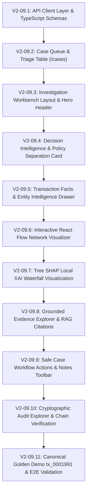

# FraudDNA V2-09 — Phased Implementation Plan
## Case + Decision Intelligence / Investigation Workbench

---

## 1. Document Control & Metadata

- **Document Version**: 2.0.0-PROD-SPEC
- **Status**: APPROVED ARCHITECTURAL SPECIFICATION (DESIGN PHASE ONLY)
- **Phase Target**: Phase V2-09 (Implementation Roadmap)
- **Author**: Lead Product Architect + Principal Engineer
- **Integration Target**: PR #15 (`v2/production-platform` $\to$ `main`)
- **Core Reference Baseline**: `docs/V2_09_PRD.md`, `docs/V2_09_INFORMATION_ARCHITECTURE.md`, `docs/V2_09_ARCHITECTURE.md`

---

## 2. Implementation Strategy & Dependency Graph

Phase V2-09 execution is organized into 11 discrete, test-driven stages:

---

## 3. Detailed Phase Breakdown

### Phase V2-09.1: Frontend API Client Layer & TypeScript Schemas
- **Objective**: Extend `frontend/lib/api.ts` with complete, strongly typed fetcher functions for all V2 backend endpoints.
- **Target Files**:
  - `frontend/lib/api.ts`
  - `frontend/types/case.ts`
  - `frontend/types/network.ts`
  - `frontend/types/agent.ts`
- **Tasks**:
  1. Add typed methods: `fetchCases`, `createCase`, `fetchCase`, `updateCaseStatus`, `fetchNetworkIntelligence`, `searchNetworkPaths`, `fetchEntityProfile`, `fetchEntityGraph`, `fetchAuditEvents`, `verifyAuditChain`.
  2. Implement robust query string formatting, error parsing via `formatErrorDetail`, and standard response types.
- **Verification**: `tsc --noEmit` and mock API call tests pass with zero type errors.

---

### Phase V2-09.2: Case Queue & Triage Table (`/cases`)
- **Objective**: Build the dedicated Case Management page allowing analysts to view, filter, sort, and triage active cases.
- **Target Files**:
  - `frontend/app/cases/page.tsx`
  - `frontend/components/cases/case-table.tsx`
  - `frontend/components/cases/case-create-modal.tsx`
  - `frontend/components/cases/case-status-badge.tsx`
- **Tasks**:
  1. Render case table with status pills, priority indicators, owner tags, and linked investigation counts.
  2. Implement filter bars for `status`, `priority`, `owner`, and text search.
  3. Wire up "New Case" modal to `POST /api/v1/cases`.
  4. Link each row directly to the Investigation Workbench (`/investigate?tx=...&case_id=...`).
- **Verification**: Verify case queue renders cases, filters apply smoothly, and row click navigates to workbench.

---

### Phase V2-09.3: Investigation Workbench Layout & Hero Header
- **Objective**: Build the 3-column responsive workbench frame with the high-impact forensic hero header.
- **Target Files**:
  - `frontend/app/investigate/page.tsx`
  - `frontend/components/workbench/hero-header.tsx`
  - `frontend/hooks/use-workbench-params.ts`
- **Tasks**:
  1. Implement synchronized URL state management for `tx`, `case_id`, `tab`.
  2. Render the primary hero card with Transaction ID, editorial Risk Score (`0.9994`), Risk Badge (`CRITICAL`), and Quick Load shortcuts (e.g., Golden Case `tx_0001991`).
  3. Structure the 3-column CSS Grid layout (Left: Facts & XAI; Center: Graph & Networks; Right: AI Findings, Evidence & Workflow).
- **Verification**: Verify responsiveness on 1920x1080 desktop, laptop, and tablet viewports.

---

### Phase V2-09.4: Decision Intelligence & Policy Separation Card
- **Objective**: Render the visual demarcation between Authoritative Policy Action and AI Advisory Recommendation.
- **Target Files**:
  - `frontend/components/workbench/decision-intelligence.tsx`
- **Tasks**:
  1. Create split-card visual component:
     - Left: Deterministic Policy Action (`HOLD`), triggered rules, and policy matrix version.
     - Right: AI Investigation Recommendation (`MANUAL_REVIEW_ESCALATION`), confidence percentage, and grounded item count.
  2. Add prominent advisory watermark and tooltip reinforcing zero financial authority for AI.
- **Verification**: Verify distinct visual treatment for `ALLOW`, `REVIEW`, and `HOLD`.

---

### Phase V2-09.5: Transaction Facts Ledger & Entity Intelligence Drawer
- **Objective**: Display comprehensive transaction metadata and slide-over entity inspection drawers.
- **Target Files**:
  - `frontend/components/workbench/transaction-ledger.tsx`
  - `frontend/components/workbench/entity-profile-drawer.tsx`
- **Tasks**:
  1. Render transaction amount in INR, timestamps, customer, card, device, IP, and merchant.
  2. Implement slide-over drawer triggered by clicking any entity ID, fetching `GET /api/v1/entities/{type}/{id}` and rendering lifetime metrics and direct relationships.
- **Verification**: Click `cust_00843` and `dev_d0339`; verify drawer opens and displays profile data without reload.

---

### Phase V2-09.6: Interactive React Flow Network Visualizer
- **Objective**: Enhance `frontend/components/fraud-graph.tsx` with V2-07 syndicate discovery capabilities.
- **Target Files**:
  - `frontend/components/fraud-graph.tsx`
  - `frontend/components/workbench/syndicate-pattern-badges.tsx`
  - `frontend/components/workbench/path-search-dialog.tsx`
- **Tasks**:
  1. Implement concentric radial layout with node-type icon glyphs and risk-tinted glow borders.
  2. Render detected syndicate pattern badges (`DEVICE_REUSE_RING`, `CARD_SHARING_RING`, `MULTI_INFRASTRUCTURE_COLLUSION`).
  3. Integrate multi-hop path search modal powered by `POST /api/v1/networks/paths/search`.
- **Verification**: Load `tx_0001991`; verify cluster nodes render, edges show semantic labels, and syndicate badges are highlighted.

---

### Phase V2-09.7: Tree SHAP Local XAI Waterfall Visualization
- **Objective**: Render local feature attribution contributions driving the transaction ML risk score.
- **Target Files**:
  - `frontend/components/workbench/shap-waterfall.tsx`
- **Tasks**:
  1. Render top 8 positive (risk-increasing) and negative (risk-reducing) SHAP feature bars.
  2. Display exact numerical impact, feature name, and actual feature value.
- **Verification**: Check `tx_0001991` SHAP signals display with correct positive/negative color accents.

---

### Phase V2-09.8: Grounded Evidence Explorer & RAG Typology Citations
- **Objective**: Render traceable evidence items and regulatory typology citations.
- **Target Files**:
  - `frontend/components/workbench/evidence-explorer.tsx`
  - `frontend/components/workbench/rag-citations-card.tsx`
  - `frontend/components/workbench/ai-dossier-card.tsx`
- **Tasks**:
  1. Categorize evidence into Transaction, Entity, Network, XAI, and Typology items.
  2. Render AI investigation hypothesis, limitations, and tool execution trace drawer.
  3. Provide interactive typology modal displaying full regulatory guidance excerpts.
- **Verification**: Verify all 10 evidence items for `tx_0001991` render with confidence scores and source provenance.

---

### Phase V2-09.9: Safe Case Workflow Actions & Notes Toolbar
- **Objective**: Equip analysts to transition case status, reassign owners, and append case notes safely.
- **Target Files**:
  - `frontend/components/workbench/case-action-toolbar.tsx`
- **Tasks**:
  1. Render status transition dropdown (`IN_REVIEW`, `ESCALATED`, `RESOLVED`, `CLOSED`).
  2. Implement notes input submitting to `PATCH /api/v1/cases/{case_id}/status`.
  3. Show toast notifications upon successful update and refresh case state.
- **Verification**: Change status from `NEW` to `IN_REVIEW` with an analyst note; verify backend persistence.

---

### Phase V2-09.10: Cryptographic Audit Explorer & Chain Verification
- **Objective**: Upgrade `/audit` page with backend-backed immutable event ledger and live hash chain verification.
- **Target Files**:
  - `frontend/app/audit/page.tsx`
  - `frontend/components/workbench/audit-events-timeline.tsx`
- **Tasks**:
  1. Fetch real audit events from `GET /api/v1/audit` with filter controls.
  2. Wire up "Verify Cryptographic Audit Chain" button to `GET /api/v1/audit/verify/chain` displaying validation badge.
  3. Render previous hash $\to$ event hash lineage for each entry.
- **Verification**: Click verify button; confirm green "100% Chain Valid" verification badge.

---

### Phase V2-09.11: Golden Demo `tx_0001991` & E2E Validation
- **Objective**: End-to-end testing and polish of the canonical 3-5 minute demo walkthrough.
- **Target Files**:
  - `frontend/app/investigate/page.tsx`
  - `backend/tests/test_e2e_pipeline.py`
- **Tasks**:
  1. Validate complete golden demo flow: Search `tx_0001991` $\to$ Review CRITICAL risk & HOLD $\to$ Explore 3 syndicate rings on graph $\to$ Inspect 10 evidence items $\to$ View AI recommendation `MANUAL_REVIEW_ESCALATION` $\to$ Escalate case $\to$ Verify audit chain.
  2. Run full regression test suite (`pytest backend/tests/ -q`).
- **Verification**: 100% test pass rate across backend and frontend type checks.

---

## 4. Rollback & Contingency Plan

If any regression occurs during implementation:
1. **Isolated UI Component Rollback**: All workbench sub-components are decoupled; any failing visualization can fall back to standard tabular cards without crashing the host page.
2. **Backend Protection**: No backend database schema or core model changes are introduced in V2-09, preserving complete backward compatibility with V2-01 through V2-08.
