# FraudDNA V2-09 — Information Architecture & Navigation Design
## Investigation Workbench & Case Management Console

---

## 1. Document Control & Metadata

- **Document Version**: 2.0.0-PROD-SPEC
- **Status**: APPROVED ARCHITECTURAL SPECIFICATION (DESIGN PHASE ONLY)
- **Phase Target**: Phase V2-09 (Information Architecture)
- **Author**: Lead Product Architect + Principal Engineer
- **Integration Target**: PR #15 (`v2/production-platform` $\to$ `main`)
- **Core Reference Baseline**: `docs/V2_09_PRD.md`, `frontend/app/`, `frontend/components/`

---

## 2. Global Site Structure & Navigation Hierarchy

FraudDNA V2-09 organizes the application into 3 clear primary navigational tiers:

```
┌─────────────────────────────────────────────────────────────────────────────┐
│                            FRAUDDNA GLOBAL IA MAP                           │
├──────────────────────┬───────────────────────────────┬──────────────────────┤
│ 1. OPERATIONS        │ 2. INTELLIGENCE EXPLORATION   │ 3. GOVERNANCE & OPS  │
├──────────────────────┼───────────────────────────────┼──────────────────────┤
│ • Overview (/)       │ • FraudDNA Network (/frauddna)│ • Audit (/audit)     │
│ • Cases (/cases)     │ • Transactions (/transactions)│ • Simulation (/sim)  │
│ • Workbench (/invest)│ • Entities (/entities)        │ • Evaluation (/eval) │
└──────────────────────┴───────────────────────────────┴──────────────────────┘
```

### 2.1 Top-Level Routes & Route Hierarchy

| Route Path | Screen Title | Primary Purpose | Key Query Parameters |
| :--- | :--- | :--- | :--- |
| `/` | **Operations Overview** | Executive summary of risk posture, critical alerts, fraud clusters, and active case queue metrics. | `as_of` |
| `/cases` | **Case Management Queue** | Triage and queue table for discovering, filtering, assigning, and opening operational cases. | `status`, `priority`, `owner`, `limit`, `offset`, `search` |
| `/cases/[case_id]` | **Case Details View** | Direct deep-link view of a specific case, linked investigations, and operational notes timeline. | `tab` (`overview`, `investigations`, `notes`, `audit`) |
| `/investigate` | **Investigation Workbench** | The core 3-column forensic investigation console synthesizing transaction facts, network graph, SHAP XAI, AI findings, and policy state. | `tx`, `case_id`, `network_id`, `entity_type`, `entity_id`, `tab` |
| `/transactions` | **Transaction Explorer** | Filterable tabular repository of incoming transactions with risk scoring and cluster tags. | `risk_level`, `suspicious_only`, `sort_by`, `sort_order`, `search`, `limit`, `offset` |
| `/frauddna` | **Risk Network Explorer** | Cluster-level exploration of detected fraud syndicates, device reuse rings, and card sharing networks. | `cluster_id`, `min_risk`, `suspicious_only` |
| `/audit` | **Immutable Audit Ledger** | Chronological tamper-evident event stream with SHA-256 hash verification and search. | `tx`, `case_id`, `event_type`, `actor`, `entity_id` |
| `/simulation` | **Policy Simulation Lab** | Cost-benefit simulator evaluating threshold operating points against false positive costs. | `sim_id` |
| `/evaluation` | **Model Evaluation Matrix** | Scientific test-set evaluation displaying PR-AUC, ROC-AUC, confusion matrices, and scenario catch rates. | `eval_type` |

---

## 3. Investigation Workbench Screen Layout & Information Hierarchy

The **Investigation Workbench** (`/investigate`) is the core analytical console. It is structured into 4 cohesive spatial zones:

```
┌─────────────────────────────────────────────────────────────────────────────┐
│ ZONE 1: UTILITY BAR & CONTEXT SWITCHER                                     │
│ [Search: txn_0001991] [Quick Load: Golden Case tx_0001991] [Case: CASE-1092]│
├─────────────────────────────────────────────────────────────────────────────┤
│ ZONE 2: PRIMARY FORENSIC HERO HEADER                                        │
│ • Transaction ID: tx_0001991  • Risk Level: CRITICAL  • Score: 0.9994       │
│ • Authoritative Decision: HOLD  • AI Advisory: MANUAL_REVIEW_ESCALATION    │
├──────────────────────────────────────┬──────────────────────────────────────┤
│ ZONE 3A: FACTS & XAI (3 cols)        │ ZONE 3B: NETWORK GRAPH & INTEL (6)   │
│ • Transaction Facts Ledger           │ • Interactive React Flow Graph       │
│ • Connected Entity Profile Card      │ • Syndicate Pattern Badges (3)       │
│ • Tree SHAP Feature Attributions    │ • Multi-Hop Path Visualizer          │
│ • Behavioral Velocity Metrics        │ • Temporal Progression Timeline      │
├──────────────────────────────────────┴──────────────────────────────────────┤
│ ZONE 3C: GROUNDED EVIDENCE, AI DOSSIER & WORKFLOW (3 cols)                  │
│ • AI Investigation Hypothesis & Dossier                                     │
│ • Grounded Evidence Items (10 items categorized)                             │
│ • RAG Typology Citations (Document Title + Chunk + Excerpt)                  │
│ • Case Status Transition Actions & Analyst Operational Notes                │
│ • Chronological Audit Events Stream                                         │
└─────────────────────────────────────────────────────────────────────────────┘
```

---

## 4. Context Persistence & Seamless Traversal Model

A risk analyst moves continuously across different intelligence facets. The workbench guarantees zero context loss via synchronized URL query states and cross-entity linking:

```mermaid
flowchart LR
    Tx["Transaction (tx_0001991)"] <--> Entity["Entity (cust_00843 / dev_d0339)"]
    Entity <--> Network["Risk Network (cluster_3dc2538b294d)"]
    Network <--> Evidence["Evidence Items (evi_8e64cbe3)"]
    Evidence <--> Agent["AI Findings (inv_agent_...)"]
    Agent <--> Decision["Policy Decision (HOLD)"]
    Decision <--> Case["Case (case_7a8f01)"]
    Case <--> Audit["Audit Trail (aud_99c321)"]
```



### 4.1 URL State Contract
The workbench URL reflects the active analytical state:
- `tx`: The primary transaction under investigation (e.g. `tx_0001991`).
- `case_id`: The parent operational case (e.g. `case_01j7x8`).
- `network_id`: The associated risk network cluster (e.g. `cluster_3dc2538b294d`).
- `selected_node`: The currently focused entity node on the React Flow graph (e.g. `card_c01928`).
- `tab`: Active central tab (`graph`, `paths`, `timeline`, `intelligence`).

When an analyst clicks an entity or connected transaction in the graph or evidence list:
1. The URL updates without triggering a full page reload (`router.replace('...', { scroll: false })`).
2. The Entity Intelligence Drawer slides in from the right, retaining the active graph and case in the background.
3. The analyst can click "Pivot Investigation to this Transaction" to switch primary transaction context with breadcrumb history preserved.

---

## 5. Breadcrumb & Navigation Flow

### 5.1 Canonical Breadcrumb Trails
1. **Case Queue Path**:  
   `Cases` $\to$ `Case #CASE-1092` $\to$ `Investigation (tx_0001991)`
2. **Network Discovery Path**:  
   `FraudDNA Networks` $\to$ `Cluster #cluster_3dc2538b294d` $\to$ `Transaction tx_0001991` $\to$ `Case #CASE-1092`
3. **Audit Tracing Path**:  
   `Audit Trail` $\to$ `Event #aud_e81792` $\to$ `Transaction tx_0001991`

---

## 6. Drawers, Modals, & Contextual Overlays

To maintain visual continuity without cluttering the main workbench:

| Overlay Component | Trigger | Contents | Actions Available |
| :--- | :--- | :--- | :--- |
| **Entity Profile Drawer** | Clicking any node in React Flow graph or entity link. | Full entity profile, risk score, account age, lifetime volume, velocity metrics, direct semantic relationships list. | "Pivot Investigation", "View Linked Transactions", "Close Drawer". |
| **Path Search Modal** | Clicking "Find Connection Path" on the network tab. | Source & Target entity selectors, maximum depth slider ($1 \le d \le 4$), ranked connection paths table with relationship edge labels. | "Highlight Path on Graph", "Export Path Evidence". |
| **Create Case Modal** | Clicking "Create Case" button in transaction or investigation header. | Title input, priority selector (`LOW`, `MEDIUM`, `HIGH`, `CRITICAL`), owner assignment, initial triage notes textarea. | "Create & Link Investigation", "Cancel". |
| **RAG Typology Viewer Modal** | Clicking on any typology reference badge in the AI dossier. | Full document excerpt, regulatory framework title (e.g., *RBI / FATF Fraud Typology Guidelines*), chunk ID, similarity match score. | "Attach to Case Evidence", "Close". |
| **Tool Execution Trace Drawer** | Clicking "Inspect Tool Trace" on the AI findings card. | Chronological list of the 5-8 tool invocations made by LangGraph, tool inputs, latency (ms), status, and returned data snippets. | "Copy Trace JSON", "Close Drawer". |
