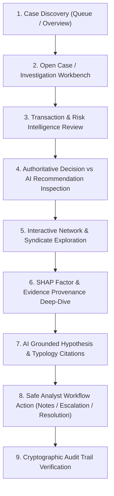

# FraudDNA V2-09 — Product Requirements Document (PRD)
## Case + Decision Intelligence / Investigation Workbench

---

## 1. Document Control & Metadata

- **Document Version**: 2.0.0-PROD-SPEC
- **Status**: APPROVED ARCHITECTURAL SPECIFICATION (DESIGN PHASE ONLY)
- **Phase Target**: Phase V2-09 (Case + Decision Intelligence / Investigation Workbench)
- **Author**: Lead Product Architect + Principal Engineer
- **Integration Target**: PR #15 (`v2/production-platform` $\to$ `main`)
- **Core Reference Baseline**: `docs/V2_HANDOFF.md`, `docs/V2_07_ARCHITECTURE.md`, `docs/V2_08_ARCHITECTURE.md`, `backend/app/models/domain.py`, `backend/app/schemas/case.py`

---

## 2. Executive Summary & Product Objective

FraudDNA has established a state-of-the-art multi-layer intelligence backend:
1. **Layer 1 (ML)**: LightGBM transaction risk scoring ($R_{tx}$) with calibrated probability estimation.
2. **Layer 2 (Graph & Network)**: NetworkX and PostgreSQL graph discovery of multi-hop fraud rings, shared infrastructure clusters, and syndicate topologies ($R_{net}$).
3. **Layer 3 (XAI)**: Tree SHAP local feature attributions providing exact mathematical contributions of behavioral signals.
4. **Layer 4 (RAG)**: In-memory and vector-grounded retrieval of regulatory compliance guidelines, AML typologies, and fraud ring playbooks.
5. **Layer 5 (Autonomous AI Agent)**: Bounded LangGraph multi-step investigation orchestrating read-only tools into evidence-grounded findings and advisory operational triage recommendations.
6. **Layer 6 (Deterministic Policy Gate)**: Pure-rule deterministic policy evaluation producing authoritative financial actions (`ALLOW`, `REVIEW`, `HOLD`).
7. **Layer 7 (Cryptographic Audit Ledger)**: Tamper-evident SHA-256 hash-chained event persistence.

**V2-09 Product Objective**:  
Transform FraudDNA from an API-centric intelligence engine into a **world-class, analyst-facing Fraud Investigation Workbench**. The workbench equips fraud and risk operations teams to rapidly discover, triage, investigate, and resolve high-risk financial incidents and coordinated syndicate attacks with end-to-end evidence transparency, interactive network graph exploration, and strict architectural safety.

The workbench fundamentally operationalizes FraudDNA's core premise:
> **"FraudDNA does not just detect suspicious transactions. It discovers the hidden relationships connecting them."**

---

## 3. The Core Architectural Invariant

FraudDNA enforces a strict, non-negotiable separation of concerns across intelligence, reasoning, UI presentation, and financial execution:

```
┌─────────────────────────────────────────────────────────────────────────────┐
│                         THE FRAUDDNA CORE INVARIANT                         │
│                                                                             │
│   ML predicts.                                                              │
│   Graph discovers.                                                          │
│   XAI explains.                                                             │
│   RAG grounds.                                                              │
│   The AI agent investigates.                                                │
│   Deterministic policies control financial actions.                         │
└─────────────────────────────────────────────────────────────────────────────┘
```

### Invariant Non-Negotiables for V2-09:
1. **Zero Financial Authority for AI & Frontend**: Neither the AI agent nor the UI client possesses the authority to approve (`ALLOW`), block (`HOLD`), or release transactions, modify risk scores, or bypass deterministic policy gates.
2. **Strict Action Vocabulary Separation**:
   - **Authoritative Financial Decisions** (`PolicyAction`): `ALLOW`, `REVIEW`, `HOLD` — produced strictly and deterministically by `PolicyEngine`.
   - **Advisory Operational Recommendations** (`AdvisoryAction`): `MANUAL_REVIEW_ESCALATION`, `MERCHANT_INQUIRY`, `CLOSE_BENIGN`, `REQUEST_ADDITIONAL_EVIDENCE`, `FREEZE_SUSPICIOUS_ENTITIES` — produced by `AgentInvestigationService` as advisory triage guidance for human analysts.
3. **Dedicated Visual Demarcation**: The UI must render Authoritative Policy Decisions and AI Advisory Recommendations in visually distinct panels, preventing any perception that AI autonomously executes financial holds or allowances.
4. **Read-Only / Safe Mutation Boundaries**: The frontend communicates solely with verified REST endpoints. Case lifecycle transitions (`NEW` $\to$ `IN_REVIEW` $\to$ `ESCALATED` $\to$ `RESOLVED` $\to$ `CLOSED`) execute through backend state machine validation with mandatory audit logging.

---

## 4. User Personas & Primary Workflows

### 4.1 Target Personas

| Persona | Role | Key Responsibilities | Primary UI Requirements |
| :--- | :--- | :--- | :--- |
| **P1: Tier-2 Fraud Operations Analyst** | Lead Case Investigator | Triages high-priority flagged transactions, investigates connected entities and graph clusters, reviews AI findings, and executes case operational notes/resolutions. | Case queue, unified Investigation Workbench, interactive network graph, SHAP factor breakdown, evidence cards, fast keyboard navigation. |
| **P2: Fraud Risk Operations Lead / Manager** | Queue & Policy Supervisor | Monitors case backlog, velocity, false positive rates, assigns high-risk cases to analysts, and tracks team resolution SLA. | Overview metrics, case assignment filters, priority triage controls, simulation comparisons. |
| **P3: Risk Compliance & Audit Officer** | Regulatory & Model Auditor | Validates compliance with anti-money laundering regulations, examines evidence provenance, and verifies cryptographic audit trails. | Audit trail viewer, SHA-256 chain verification badge, RAG typology citations, full tool trace inspectability. |

### 4.2 Primary Investigation Workflow



---

## 5. Functional Requirements (FR-01 to FR-20)

### 5.1 Case Discovery & Queue Management
- **FR-01 (Case Discovery)**: The system must provide an overview dashboard displaying aggregate risk posture, critical incident counts, active fraud clusters, and case backlog metrics.
- **FR-02 (Case Queue & Triage Table)**: The system must present a paginated, sortable, filterable case management table supporting filtering by `status` (`NEW`, `IN_REVIEW`, `ESCALATED`, `RESOLVED`, `CLOSED`), `priority` (`LOW`, `MEDIUM`, `HIGH`, `CRITICAL`), `owner`, date range, and risk tier.
- **FR-03 (Case Creation & Binding)**: Analysts must be able to initiate a new case directly from any transaction or cluster view, with automatic binding of primary transaction ID, network cluster ID, initial priority, and optional triage notes.
- **FR-04 (Case Detail & Metadata)**: The case view must render case metadata (ID, title, status, priority, owner, timestamps), linked investigations, attached evidence, and history.

### 5.2 Investigation Workbench & Multi-Layer Intelligence
- **FR-05 (Unified Investigation Workbench)**: The workbench must display complete forensic context for a transaction in a structured 3-column layout without requiring page reloads or fragmented navigation.
- **FR-06 (Transaction Facts Ledger)**: Displays empirical transaction facts (amount in INR, UTC and local timestamps, customer ID, payment method, card ID, merchant ID, terminal device ID, originating IP address, geolocation).
- **FR-07 (Entity Intelligence Drawer)**: Provides on-demand modal/drawer drill-downs for any connected entity (`customer`, `account`, `card`, `device`, `ip`, `merchant`) detailing lifetime volume, first/last seen dates, velocity metrics, and direct semantic relationships.
- **FR-08 (Network Syndicate Intelligence)**: Displays cluster-level analytics including aggregate network risk score, member entity counts, suspicious exposure amounts, density, temporal burst velocity, and detected syndicate signatures.
- **FR-09 (Interactive Network Graph)**: Renders a high-performance React Flow graph visualizing ego-networks and cluster topologies, with distinct node glyphs, risk-tinted borders, semantic edge labels (`OWNS`, `DEBITS`, `ON_DEVICE`, `FROM_IP`, `USING_CARD`, `MEMBER_OF_NETWORK`), depth controls ($1 \le d \le 3$), and click-to-focus entity selection.
- **FR-10 (Temporal Progression Timeline)**: Displays a chronological event timeline showing the sequence of transactions across connected cards and devices within the network.
- **FR-11 (Evidence Explorer & Provenance)**: Renders all gathered evidence items categorized by type (`TRANSACTION_EVIDENCE`, `ENTITY_EVIDENCE`, `NETWORK_EVIDENCE`, `ML_SIGNAL_EVIDENCE`, `TYPOLOGY_EVIDENCE`, `AUDIT_EVIDENCE`), displaying severity, confidence, source repository, and direct link to source data.
- **FR-12 (Tree SHAP Explainability)**: Visualizes the top 8 positive and negative feature attribution forces driving the ML transaction risk score, rendering exact feature values, impact bars, and risk direction.

### 5.3 AI Investigation & Decision Intelligence
- **FR-13 (AI Grounded Findings & Hypothesis)**: Presents the LangGraph agent's structured investigation dossier, including executive summary, fraud hypothesis, step count, confidence score, limitations, and degraded execution indicators.
- **FR-14 (RAG / Typology Provenance)**: Displays retrieved regulatory typologies and AML guidelines cited by the agent, showing document title, category, chunk ID, relevance similarity, and excerpt text.
- **FR-15 (Decision Intelligence Separation)**: Renders a prominent side-by-side comparison card:
  - **Left / Primary**: Authoritative Deterministic Decision (`ALLOW`, `REVIEW`, `HOLD`) with rule version and triggered reason codes.
  - **Right / Advisory**: AI Investigation Recommendation (`MANUAL_REVIEW_ESCALATION`, `CLOSE_BENIGN`, etc.) with confidence level and grounded evidence count.

### 5.4 Analyst Workflow & Audit
- **FR-16 (Safe Analyst Workflow Actions)**: Analysts can transition case status (`NEW` $\to` `IN_REVIEW` $\to` `ESCALATED` / `RESOLVED` / `CLOSED`), reassign owner, and append structured operational notes via backend service endpoints.
- **FR-17 (Immutable Audit Trail)**: Renders chronological audit events associated with the transaction, case, and investigation, with actor identification, timestamp, payload details, and SHA-256 block hash.
- **FR-18 (Cryptographic Chain Verification)**: Allows compliance officers to trigger on-demand cryptographic verification (`GET /api/v1/audit/verify/chain`) displaying real-time integrity status.
- **FR-19 (Search, Filter, & URL State)**: All workbench views must maintain synchronized URL search parameters (e.g., `?tx=tx_0001991&case=case_01&tab=network`), enabling deep linking, browser history traversal, and bookmarking.
- **FR-20 (Golden Demo Experience)**: Built-in 1-click loading and highlighted walkthrough for canonical golden case `tx_0001991` showcasing critical risk score (`0.9994`), 3 syndicate patterns, 10 grounded evidence items, `HOLD` decision, and `MANUAL_REVIEW_ESCALATION` advisory action.

---

## 6. Non-Functional Requirements (NFR)

### 6.1 Performance & Latency
- **NFR-01 (Initial Page Load)**: Workbench and Case Queue initial load must achieve First Contentful Paint (FCP) $< 1.2\text{s}$ and Time to Interactive (TTI) $< 2.0\text{s}$ on broadband connections.
- **NFR-02 (Graph Rendering)**: React Flow subgraphs with up to 100 nodes and 200 edges must render and layout within $< 150\text{ms}$ with zero frame drops during panning/zooming.
- **NFR-03 (API Query Bounds)**: All list endpoints must enforce pagination bounds ($1 \le \text{limit} \le 200$) to guarantee sub-100ms API response times.

### 6.2 Security & Threat Mitigation
- **NFR-04 (Input Sanitization)**: All analyst notes and transaction metadata must be strictly sanitized against Cross-Site Scripting (XSS).
- **NFR-05 (Untrusted Content Isolation)**: AI-generated summaries and RAG excerpts must be rendered as escaped text or sanitized Markdown, never raw HTML.
- **NFR-06 (Authorization & Zero Financial Control)**: Frontend must not contain UI controls or API hooks capable of overriding deterministic policy decisions or editing financial balances.
- **NFR-07 (IDOR Prevention)**: All case, investigation, and network lookups must execute against validated backend route parameters with strict 404/403 domain error handling.

### 6.3 Accessibility & Design System
- **NFR-08 (WCAG 2.1 AA Compliance)**: All text elements must satisfy minimum 4.5:1 contrast ratios.
- **NFR-09 (Color-Independent Status)**: Risk tiers (`LOW`, `MEDIUM`, `HIGH`, `CRITICAL`), policy decisions (`ALLOW`, `REVIEW`, `HOLD`), and case statuses must use distinct icon glyphs and textual labels in addition to color coding.
- **NFR-10 (Keyboard Navigation)**: All interactive modals, tabs, search inputs, and dropdowns must support standard keyboard navigation (`Tab`, `Esc`, `Enter`, arrow keys).

---

## 7. Acceptance Criteria Gate

Phase V2-09 will achieve acceptance when:
1. An analyst can discover, filter, and open cases from `/cases` and navigate directly into the `/investigate` workbench.
2. Canonical transaction `tx_0001991` renders `0.9994` risk score, authoritative `HOLD` banner, and `MANUAL_REVIEW_ESCALATION` AI recommendation.
3. Interactive React Flow graph correctly renders nodes, semantic edges, and highlights `DEVICE_REUSE_RING`, `CARD_SHARING_RING`, and `MULTI_INFRASTRUCTURE_COLLUSION`.
4. SHAP feature attributions, evidence items, and RAG typology citations are displayed with clear source provenance.
5. Case workflow actions (status transitions, owner assignments, notes) mutate state cleanly through `/api/v1/cases` and record immutable audit events.
6. The audit page cryptographically validates the SHA-256 block hash chain.
7. Zero financial modification capabilities exist in the frontend.
8. All existing 249 backend tests remain 100% green.
