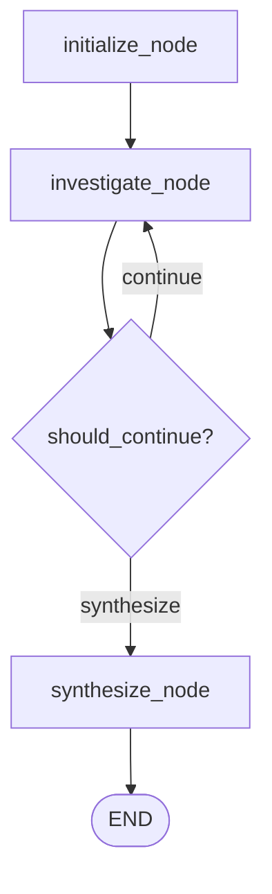

# FraudDNA — AI Investigation Agent Design

## Architectural Core Principle

> **"ML predicts. Graph discovers. XAI explains. RAG grounds. The AI agent investigates. Deterministic policies control financial actions."**

The FraudDNA AI Investigation Agent is a **read-only, evidentiary investigation assistant** powered by LangGraph. It explores multi-modal risk signals, coordinates graph neighborhood traversal, retrieves relevant policies and historical fraud syndicate cases from RAG, and produces structured, verifiable findings.

**Hard Security Boundary:**
The AI Investigation Agent is strictly **prohibited** from:
- Approving, blocking, releasing, or refunding transactions
- Modifying account statuses or balances
- Mutating database records
- Executing arbitrary code or arbitrary SQL queries
- Accessing external internet APIs or arbitrary filesystem paths

---

## 1. LangGraph Agent Architecture

### State Machine Lifecycle
1. **`initialize_node`**:
   - Validates transaction ID against the FraudDNA graph and dataset.
   - Allocates a step budget (`AGENT_MAX_STEPS = 8`).
   - Generates deterministic investigation ID (`inv_agent_<hash>`).
   - Initializes clean, bounded state buffers (zero unbounded conversation accumulation).
2. **`investigate_node`**:
   - Evaluates evidence needs and invokes allowlisted tools sequentially.
   - Measures latency, records tool execution parameters, and isolates errors.
3. **`should_continue` conditional edge**:
   - Checks if step count reached `max_steps` or if all necessary tools have been executed.
4. **`synthesize_node`**:
   - Assembles structured findings matching the `AgentInvestigationOutput` Pydantic schema.
   - Validates confidence, risk score alignment, grounded evidence items, and limitation disclosures.

---

## 2. Tool Allowlist & Boundaries

The agent has access to **only** 7 strictly bounded, read-only tools:

| Tool | Purpose | Source Subsystem |
| :--- | :--- | :--- |
| `get_transaction_history` | Look up amount, timestamp, merchant, and customer velocity | Transaction Dataset |
| `get_customer_profile` | Inspect customer account age and linked entity footprint | FraudDNA Graph |
| `get_related_entities` | Inspect direct neighbor entities and cross-account sharing | FraudDNA Graph |
| `get_cluster_analysis` | Retrieve FraudDNA cluster risk, size, and suspiciousness | NetworkX Graph Clustering |
| `get_risk_explanation` | Retrieve Tree SHAP feature attribution factors and directions | LightGBM XAI |
| `search_historical_cases` | Query similar past syndicate operations and patterns | Phase 4 RAG |
| `retrieve_policy` | Retrieve escalation SLAs, thresholds, and guidelines | Phase 4 RAG |

---

## 3. Failure Safety & Graceful Degradation

| Failure Mode | System Behavior | Outcome |
| :--- | :--- | :--- |
| **Missing Transaction** | Fails fast with `TransactionNotFoundError` (HTTP 404) | No fabricated investigations |
| **LLM Unavailability** | Deterministic rule-based tool orchestration and synthesis | Clean structured findings with `status="degraded"` |
| **RAG Unavailable** | Explicit limitation recorded; zero hallucinated citations | Marked in findings; passes to Policy Engine |
| **Max Steps Exceeded** | Agent terminates at budget cap; synthesizes available evidence | Bounded execution guaranteed |
| **Tool Execution Error** | Error isolated in `tool_trace`; execution continues | Robust fault tolerance |

---

## 4. API Endpoints

- `POST /api/v1/agent/investigate` — Initiates a bounded LangGraph agent investigation.
- `GET /api/v1/agent/investigate/{investigation_id}` — Retrieves cached structured findings.
