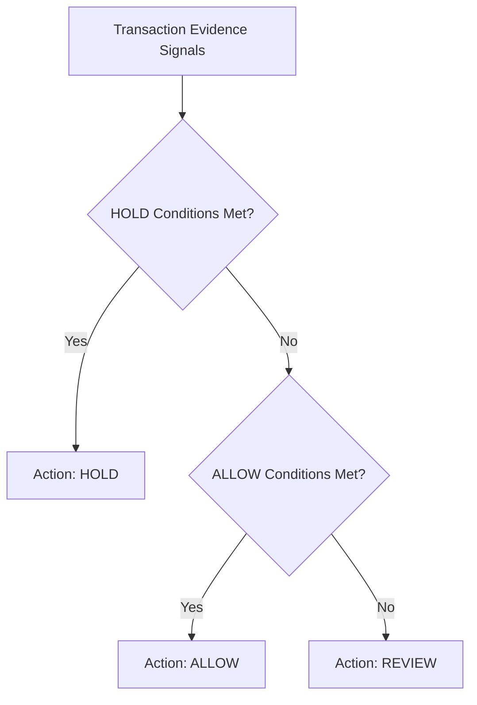

# FraudDNA — Deterministic Policy Engine Design

## Architectural Purpose

The **Policy Engine** is the deterministic decision gatekeeper for FraudDNA. It consumes multi-signal evidence produced by ML models, XAI feature attribution, FraudDNA graph coordination analysis, and RAG knowledge retrieval to output an authoritative financial recommendation:

- `ALLOW` — Auto-approve low-risk baseline transactions.
- `REVIEW` — Route to risk operations / human analyst review.
- `HOLD` — Intercept high-risk or coordinated syndicate transactions.

**Core Principle:**
> The Policy Engine is **100% deterministic**. It contains **zero LLM reasoning**, zero randomness, and zero non-deterministic side effects. Given the same input evidence, it produces the exact same decision and reason codes every time.

---

## 1. Decision Matrix & Precedence Rules



### Precedence Hierarchy:

1. **HOLD (Intercept)**:
   - `CRITICAL_RISK_SCORE`: `risk_score >= 0.90`
   - `SUSPICIOUS_FRAUD_CLUSTER`: `cluster.is_suspicious == True` AND `cluster_risk_score >= 0.70`
   - `HIGH_RISK_SCORE` + `SHARED_HARDWARE_DEVICE` / `SHARED_PAYMENT_INSTRUMENT`: `risk_score >= 0.70` with cross-account hardware/card sharing.
2. **ALLOW (Pass)**:
   - `LOW_RISK_BASELINE`: `risk_score < 0.30` AND NOT in a suspicious cluster AND no shared hardware/card entities across accounts.
3. **REVIEW (Analyst Escalation)**:
   - `MODERATE_RISK_ELEVATED`: `0.30 <= risk_score < 0.70`
   - `HIGH_RISK_SCORE`: `0.70 <= risk_score < 0.90` without decisive hold criteria
   - `RAG_EVIDENCE_DEGRADED`: Policy or case knowledge store is operating in degraded/unavailable mode
   - `INVESTIGATION_FALLBACK`: Upstream ML or graph signals operated with partial degradation

---

## 2. Structured Reason Codes

All policy decisions are accompanied by auditable, machine-readable reason codes:

- `LOW_RISK_BASELINE`
- `MODERATE_RISK_ELEVATED`
- `HIGH_RISK_SCORE`
- `CRITICAL_RISK_SCORE`
- `SUSPICIOUS_FRAUD_CLUSTER`
- `SHARED_HARDWARE_DEVICE`
- `SHARED_IP_SUBNET`
- `SHARED_PAYMENT_INSTRUMENT`
- `HIGH_VELOCITY_BURST`
- `INSUFFICIENT_EVIDENCE`
- `RAG_EVIDENCE_DEGRADED`
- `AGENT_UNCERTAINTY`
- `POLICY_ESCALATION_REQUIRED`
- `INVESTIGATION_FALLBACK`

---

## 3. Decision Audit Model

```python
class PolicyDecision(BaseModel):
    decision_id: str             # Deterministic hash: dec_<sha256(tx:score:ver:action)[:16]>
    transaction_id: str          # Evaluated transaction
    action: PolicyAction         # ALLOW | REVIEW | HOLD
    reason_codes: list[str]      # Verified supporting reason codes
    risk_score: float            # Transaction risk score
    risk_level: str              # low | medium | high | critical
    cluster_id: str | None       # Cluster context if present
    policy_version: str          # Rule version (e.g. "2025.1")
    evidence_summary: list[str]  # Human-readable evidence items
    created_at: datetime         # Timestamp
    is_deterministic: bool       # True
```

---

## 4. API Endpoints

- `POST /api/v1/decisions/evaluate` — Evaluates a transaction and returns an audit-grade `PolicyDecision`.
- `GET /api/v1/decisions/{transaction_id}` — Retrieves or computes the policy decision for a transaction.
